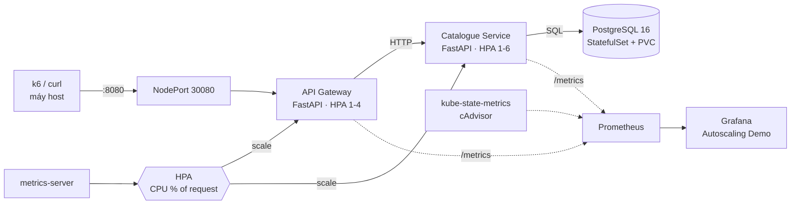

# Kiến trúc và luồng request

## Luồng request tiêu biểu

1. Client gọi `GET /api/products/7` vào Gateway (NodePort → Service `shop-gateway`).
2. Gateway chuyển tiếp tới Service `shop-catalogue` (`/products/7`).
3. Catalogue truy vấn PostgreSQL (`shop-postgres`, headless Service) và trả JSON.
4. `GET /api/stress?ms=25` đi cùng đường nhưng Catalogue đốt CPU ~25 ms — tín hiệu tải có kiểm soát cho HPA.

## Cơ chế autoscaling

- `metrics-server` đo CPU từng Pod; HPA so sánh **mức dùng trung bình / `requests.cpu`** với ngưỡng (Catalogue 50%, Gateway 60%).
- `replicas = ceil(current × usage / target)`, giới hạn trong `[min, max]`.
- Scale-up không có cửa sổ ổn định; scale-down giữ 60 s (mặc định k8s: 300 s) để tránh dao động.

## Cluster

kind: 1 control-plane + 2 worker (Docker container). Pod ứng dụng được scheduler rải trên 2 worker; PostgreSQL có PVC (StorageClass `standard` của kind).
